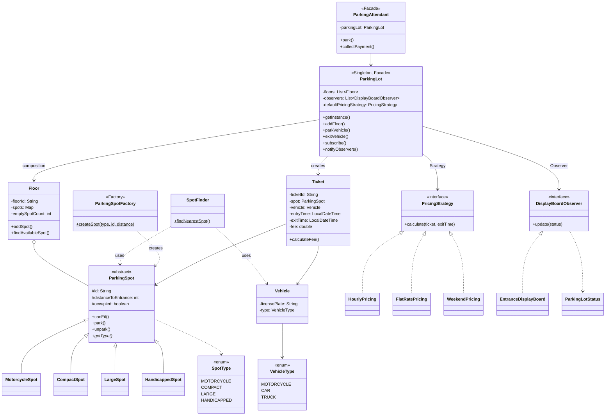

# Parking Lot — LLD Interview Revision

> **Revise time:** ~8–10 min | **Focus:** Patterns → SOLID → OOP → Class diagram

---

## Interview order (use this every LLD)

| Step | What to do in interview | Time |
|------|-------------------------|------|
| **1. Clarify** | Functional scope, assumptions, out of scope | 2–3 min |
| **2. Entities** | Nouns → classes | 2 min |
| **3. Flows** | Entry / exit flow (ASCII) | 3–5 min |
| **4. Patterns** | Name pattern + *why* + **class diagram** | 3–4 min |
| **5. SOLID + OOP** | Tie to class diagram | 2 min |
| **6. Design** | Class diagram + package map | 3–5 min |
| **7. Code** | Skeleton + edge cases | rest |

---

## 1. Clarifications (ask first)

| Topic | Assumption (this project) |
|-------|---------------------------|
| Floors | Multiple floors, search ground-up |
| Vehicles | MOTORCYCLE, CAR, TRUCK |
| Spots | Motorcycle, Compact, Large, Handicapped |
| Pricing | Hourly + flat + weekend surcharge (Strategy) |
| Display | Real-time boards (Observer) |
| Reservations | No |
| Handicapped | Car only |
| Out of scope | Payments gateway, ANPR cameras, DB persistence |

---

## 2. Entities

| Entity | Responsibility |
|--------|----------------|
| `ParkingLot` | Singleton controller, park/exit, notify boards |
| `Floor` | Spots on one level, empty count |
| `ParkingSpot` | Abstract spot; park / unpark / canFit |
| `Vehicle` | License plate + type |
| `Ticket` | Entry/exit time, spot, fee |
| `PricingStrategy` | Calculate fee on exit |
| `DisplayBoardObserver` | Show available / FULL |
| `SpotFinder` | Nearest available spot (PriorityQueue) |
| `ParkingAttendant` | Facade for park + collect payment |
| `ParkingSpotFactory` | Create spot by type |

---

## 3. Flow (entry / exit)

```
Vehicle arrives
      │
      ▼
ParkingLot.parkVehicle()
      │
      ▼
Find spot (floor order → nearest by distance) ──no spot──► notify FULL → return null
      │
      ▼
spot.park() → issue Ticket → notify display board

Driver returns with Ticket
      │
      ▼
ParkingLot.exitVehicle(ticket, pricingStrategy)
      │
      ▼
markExit → calculateFee → spot.unpark() → notify display board
```

**Edge cases:** lot full | wrong spot type (truck in compact) | long stay daily cap | weekend surcharge

---

## 4. Design patterns (say name + why + class)

| Type | Pattern | Class / package | Why |
|------|---------|-----------------|-----|
| Creational | **Singleton** | `ParkingLot` | One parking lot instance |
| Creational | **Factory** | `ParkingSpotFactory` | Create spot types without `new` everywhere |
| Structural | **Facade** | `ParkingAttendant`, `ParkingLot` | Simple park/exit API |
| Behavioral | **Strategy** | `pricing/*` | Hourly / flat / weekend pricing |
| Behavioral | **Observer** | `display/*` | Boards update on park/exit |

**Also use:** abstract `ParkingSpot` (inheritance + polymorphism).

**No interface (OK):** `SpotFinder`, `Floor` — single implementation.

---

## 5. SOLID + OOP (point at class diagram below)

### SOLID

| | One line + where |
|---|------------------|
| **S** | `Floor` = one level; `Ticket` = ticket data; each pricing class = one rule |
| **O** | New `EventPricing` or `ElectricSpot` without changing existing code |
| **L** | Any `PricingStrategy` / `ParkingSpot` substitutable |
| **I** | `PricingStrategy` and `DisplayBoardObserver` are small focused interfaces |
| **D** | `ParkingLot` depends on `PricingStrategy`, not `HourlyPricing` |

### OOP

| Concept | Where |
|---------|--------|
| Encapsulation | Spot occupied flag, ticket fee private |
| Abstraction | `ParkingSpot`, `PricingStrategy`, `DisplayBoardObserver` |
| Inheritance | `CompactSpot`, `LargeSpot`, … extend `ParkingSpot` |
| Polymorphism | `spot.canFit(vehicle)` via `SpotType` |
| Composition | Lot *has* floors, observers, pricing strategy |

---

## 6. Class diagram



**Legend:** `..|>` implements · `<|..` / `<|--` inheritance · `-->` association · `o--` aggregation

### Code map

```
com.parkinglot/
├── ParkingLot.java           ← Singleton + Facade
├── ParkingAttendant.java
├── SpotFinder.java
├── ParkingLotDemo.java
├── vehicle/
├── spot/                     ← abstract + 4 concrete spots
├── floor/
├── ticket/
├── pricing/                  ← Strategy pattern
├── display/                  ← Observer pattern
└── factory/                  ← Factory pattern
```

```bash
mvn compile exec:java -Dexec.mainClass=com.parkinglot.ParkingLotDemo
mvn test
```

### Unit tests (interview scenarios)

| Test | Scenario |
|------|----------|
| `parkCar_*` | Car → nearest compact/handicapped |
| `parkTruck_*` | Truck → large spot only |
| `parkMotorcycle_*` | Motorcycle spot |
| `lotFull_*` | Null ticket + Observer FULL |
| `exitVehicle_*` | Spot freed, fee calculated |
| `spotFinder_*` | Nearest spot by distance |
| `ParkingSpotTest` | canFit per spot type |
| `PricingStrategyTest` | Hourly, flat, weekend, long stay |

---

## 30-second pitch (memorize)

> “Multiple floors, vehicle types mapped to spot types. **Singleton** lot, **Factory** for spots, **Strategy** for pricing, **Observer** for display boards. Park: find nearest spot → ticket. Exit: pricing strategy → fee → unpark → notify. Abstract `ParkingSpot` with compact/large/handicapped/motorcycle. Edge cases: lot full, wrong vehicle type, long-stay daily cap, weekend surcharge.”

---

## Pre-interview checklist (60 sec)

- [ ] 5 patterns + *why* (Singleton, Factory, Facade, Strategy, Observer)
- [ ] Class diagram from memory
- [ ] Entry + exit flow (ASCII)
- [ ] Spot ↔ vehicle matching rules
- [ ] S/O/L/I/D one example each
- [ ] 3 edge cases: lot full, truck in compact, weekend pricing

---

## README pattern for all 15 LLD projects

```
Learn/<ProjectName>/README.md
```

| # | Section |
|---|---------|
| 1 | Interview order |
| 2 | Clarifications |
| 3 | Entities |
| 4 | Flow (ASCII) |
| 5 | Patterns |
| 6 | SOLID + OOP |
| 7 | **Class diagram** + code tree |
| 8 | Pitch + checklist |

**Revise:** ~8–10 min/project · day-of: pitch + class diagram + checklist.
