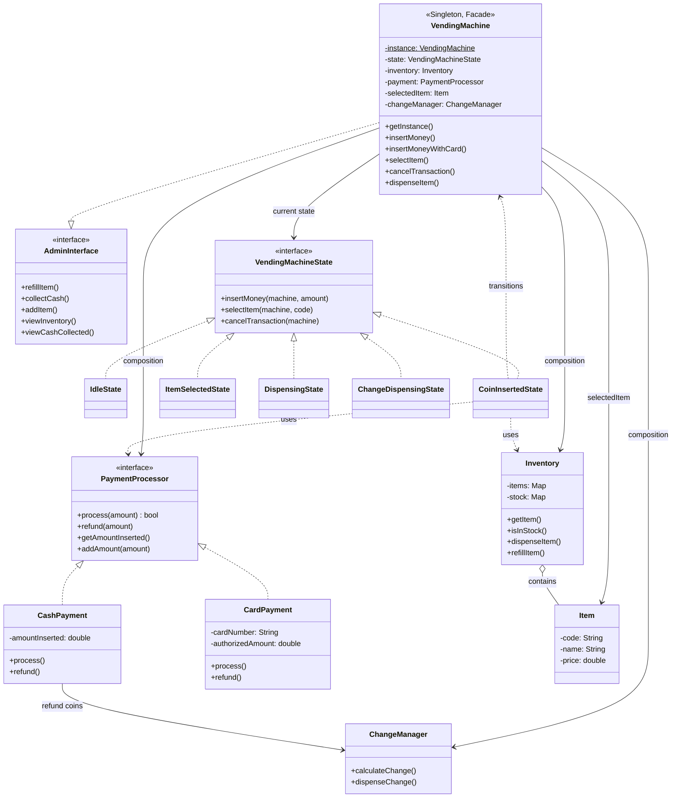

# Vending Machine — LLD Interview Revision

> **Revise time:** ~8–10 min | **Focus:** Patterns → SOLID → OOP → Class diagram

---

## Interview order (use this every LLD)

| Step | What to do in interview | Time |
|------|-------------------------|------|
| **1. Clarify** | Functional scope, assumptions, out of scope | 2–3 min |
| **2. Entities** | Nouns → classes | 2 min |
| **3. Flows** | State flow (ASCII) | 3–5 min |
| **4. Patterns** | Name pattern + *why* + **class diagram** | 3–4 min |
| **5. SOLID + OOP** | Tie to class diagram | 2 min |
| **6. Design** | Class diagram + package map | 3–5 min |
| **7. Code** | Skeleton + edge cases | rest |

---

## 1. Clarifications (ask first)

| Topic | Assumption (this project) |
|-------|---------------------------|
| Payment | Cash + card |
| Items | Single item per transaction |
| Change | Yes, greedy coin algorithm |
| Cancel | Refund at COIN_INSERTED / ITEM_SELECTED |
| Stock | Out-of-stock check before dispense |
| Admin | Refill, add item, collect cash |
| Out of scope | Multi-item cart, concurrent users, DB |

---

## 2. Entities

| Entity | Responsibility |
|--------|----------------|
| `VendingMachine` | Controller, state holder, facade |
| `VendingMachineState` | Phase-specific behavior |
| `Item` | Product (code, name, price) |
| `Inventory` | Stock in/out |
| `PaymentProcessor` | Pay / refund strategy |
| `ChangeManager` | Dispense change (greedy) |
| `AdminInterface` | Admin operations contract |

---

## 3. Flow (state machine)

```
IDLE ──insertMoney──► COIN_INSERTED ──selectItem──► ITEM_SELECTED
                              │                           │
                         cancel/refund              cancel/refund
                              ▼                           ▼
                             IDLE ◄──────────────────── IDLE

ITEM_SELECTED ──dispense──► DISPENSING ──change?──► CHANGE_DISPENSED ──► IDLE
```

**Happy path:** insert → select → dispense → change → idle  

**Edge cases:** insufficient funds | out of stock | no cancel in DISPENSING

---

## 4. Design patterns (say name + why + class)

| Type | Pattern | Class / package | Why |
|------|---------|-----------------|-----|
| Creational | **Singleton** | `VendingMachine` | One physical machine |
| Structural | **Facade** | `VendingMachine` | One API: `insertMoney`, `selectItem`, `cancel` |
| Behavioral | **State** | `state/*` | Rules change per phase |
| Behavioral | **Strategy** | `payment/*` | Cash vs card without `if/else` in states |

**Do not claim:** Template Method.

**No interface (OK):** `Inventory`, `ChangeManager` — YAGNI.

---

## 5. SOLID + OOP (point at class diagram below)

### SOLID

| | One line + where |
|---|------------------|
| **S** | `Inventory` stock only; each `*State` one phase; `ChangeManager` coins only |
| **O** | New `UPIPayment` / new state without editing existing classes |
| **L** | Any `PaymentProcessor` / `VendingMachineState` substitutable |
| **I** | `AdminInterface` ≠ customer methods on machine |
| **D** | Depend on `PaymentProcessor`, not `CashPayment` |

### OOP

| Concept | Where |
|---------|--------|
| Encapsulation | Private fields, public methods |
| Abstraction | `VendingMachineState`, `PaymentProcessor`, `AdminInterface` |
| Polymorphism | Current `state` / `payment` drives behavior |
| Composition | Machine *has* inventory, change, payment, state |
| Interfaces | `implements` over deep `extends` |

---

## 6. Class diagram



**Legend:** `..|>` implements · `<|..` implements interface · `-->` association · `o--` aggregation

### Code map

```
com.vendingmachine/
├── VendingMachine.java      ← Singleton + Facade + Admin
├── VendingMachineDemo.java
├── state/                   ← State pattern (5 classes)
├── payment/                 ← Strategy pattern
├── inventory/
├── change/
└── admin/
```

```bash
mvn compile exec:java -Dexec.mainClass=com.vendingmachine.VendingMachineDemo
```

---

## 30-second pitch (memorize)

> “I clarified cash/card, single item, change, cancel, admin. Entities: machine, states, inventory, payment, change. **State** for phases, **Strategy** for payments, **Singleton** for one machine, **Facade** for one API. Class diagram shows interfaces vs concrete classes. SOLID: segregated admin interface, depend on payment interface. Flow: idle → coin → select → dispense → change → idle.”

---

## Pre-interview checklist (60 sec)

- [ ] 4 patterns + *why*
- [ ] Class diagram from memory (interfaces + 5 states + 2 payments)
- [ ] State flow (ASCII)
- [ ] S/O/L/I/D one example each
- [ ] 3 edge cases: insufficient funds, out of stock, cancel rules

---

## README pattern for all 15 LLD projects

```
Learn/<ProjectName>/README.md
```

| # | Section |
|---|---------|
| 1 | Interview order |
| 2 | Clarifications |
| 3 | Entities |
| 4 | Flow (ASCII) |
| 5 | Patterns |
| 6 | SOLID + OOP |
| 7 | **Class diagram** + code tree |
| 8 | Pitch + checklist |

**Revise:** ~8–10 min/project · day-of: pitch + class diagram + checklist.
